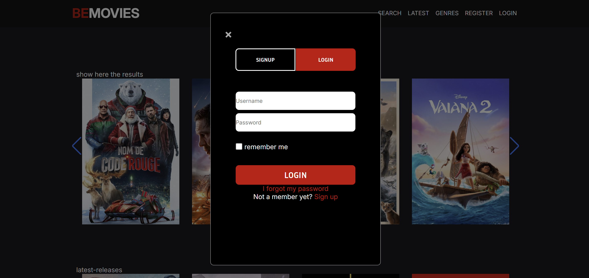

                            ✨ Projet MovieDB : Intégration Figma et API (Première Utilisation) ✨


 


## ✏️ Description
Le projet MovieDB a été conçu pour combiner l'apprentissage de Figma et l'intégration d'API, en particulier MovieDB et Swiper. L'objectif était de créer un site web avec une structure pixel perfect basée sur une maquette Figma et d'y intégrer des éléments dynamiques via les API. Le projet a été réalisé en groupe de deux, avec une approche collaborative unique : chaque membre du groupe a d'abord conçu la partie visuelle (HTML/CSS) de manière indépendante. Ensuite, les membres ont échangé leurs fichiers HTML/CSS pour que chacun travaille exclusivement sur la partie JavaScript de l'autre, en intégrant les API sans modifier la structure initiale.

## 💻 Technologies utilisées
**Figma** : Pour la conception et la mise en place d'un design pixel perfect.

**HTML5 & CSS3** : Pour créer la structure et le style de la page web, conformément à la maquette Figma.

**JavaScript** : Pour intégrer les API MovieDB et Swiper, ajouter des éléments dynamiques, et effectuer les ajustements nécessaires.

**API MovieDB** : Pour récupérer des données sur les films (titres, descriptions, affiches) et les afficher dynamiquement sur le site.

**Swiper** : Pour créer des carrousels interactifs et dynamiques, offrant une navigation fluide entre les éléments du site.

## Caractéristiques principales 🚀

🎯 Design pixel perfect :
La partie visuelle a été développée en suivant fidèlement la maquette Figma, garantissant une correspondance exacte entre le design et la version finale du site.

🎨 Intégration API MovieDB :
Les données des films sont récupérées et affichées dynamiquement grâce à l'API MovieDB. Cela permet de mettre à jour le contenu de manière dynamique en fonction des données externes.

📚 Utilisation de Swiper :
Un carrousel interactif a été ajouté en utilisant Swiper, permettant une navigation fluide entre les différents films, les catégories, ou les recommandations.

🔄 Collaboration en deux étapes :
Chaque membre a commencé par développer la base visuelle (HTML/CSS). Ensuite, les fichiers ont été échangés pour que chaque personne travaille sur la partie JavaScript de l'autre, intégrant les API et réalisant les ajustements nécessaires. Cette approche a permis à chacun de se concentrer pleinement sur l'intégration dynamique sans toucher au code visuel initial.

🧑‍🏫 Apprentissage des API et collaboration :
Ce projet a été une excellente occasion de découvrir comment dynamiser un site avec des API, tout en apprenant à collaborer efficacement en échangeant les rôles de manière structurée.

## LIEN:
[ICI](https://be-movie-woad.vercel.app/)
## 🛠️ Installation & Utilisation

1. Cloner le dépôt 

```
git clone https://github.com/BertrandM22/MovieDBProject.git           

```

2. Ouvrir le projet :

Ouvre le fichier index.html dans ton navigateur préféré pour voir le projet en action.

